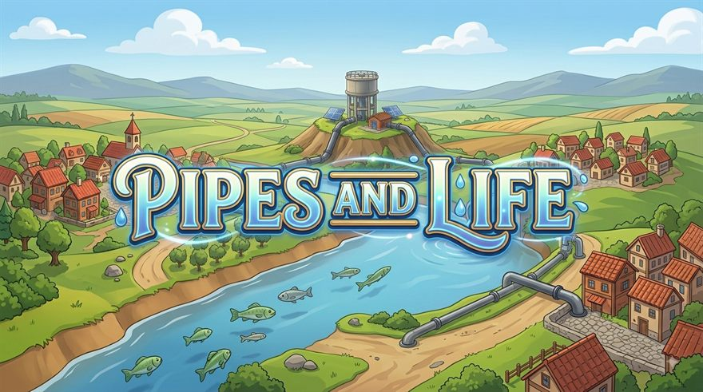
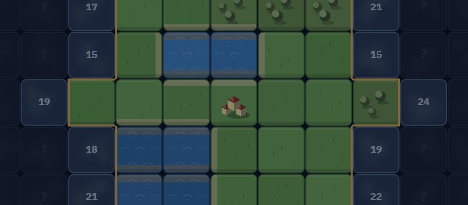
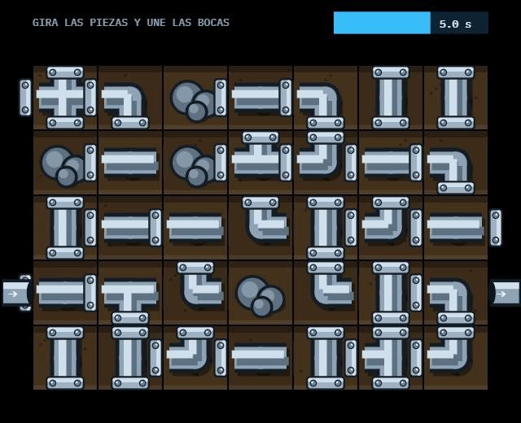
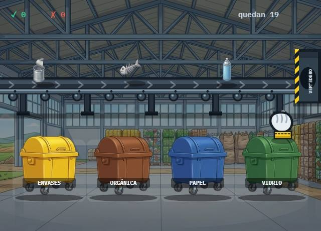

# Pipes and Life

**Abastece a tu mancomunidad, pueblo a pueblo.**

### ▶ [Jugar ahora](https://gwi1i.github.io/pipes-and-life/) — gratis, en el navegador, también en el móvil

Capta el agua, guárdala en alto, llévala lejos y devuélvela limpia. **Treinta
y seis pueblos** esperan repartidos por un territorio que se destapa clicando;
el oficio es de verdad — el juego está hecho por un profesional del
abastecimiento, y todo lo que enseña (por qué un sondeo puede salir seco, por
qué manda el tramo más estrecho de la tubería, por qué la maceta no va al
contenedor verde) es como en la realidad.

## Qué hay dentro

- **Un mapa de exploración** con nueve terrenos, ríos, acuíferos escondidos,
  yacimientos arqueológicos y zonas protegidas que obligan a dar rodeos.
- **Cuatro redes** que se trazan a mano, casilla a casilla: abastecimiento,
  saneamiento, pluviales y la carretera de los residuos. Manda siempre el
  tramo más estrecho, y las tuberías envejecen.
- **El agua subterránea en tres pasos**: estudio hidrogeológico, sondeo (que
  puede salir seco) y pozo. Y el acuífero se agota si lo sobreexplotas.
- **Minijuegos opcionales**: la reparación a mano (gira las piezas antes de
  que llegue el agua) y la línea de reciclaje (cada residuo a su contenedor —
  y no todo se recicla).
- **Manuel**, el guía veterano: te acompaña en los primeros pasos, comenta tu
  partida y, si le das voz, te la cuenta.
- **Un año vivo**: estaciones, estiaje en verano, tormentas que revientan el
  colector, averías con sitio en el mapa.

| El mapa | Reparación a mano | La línea de reciclaje |
|---|---|---|
|  |  |  |

## Ejecutarlo en local

**Doble clic en `jugar.bat`** (Windows): busca Python, levanta el servidor y
abre el navegador. Por consola: `py servidor.py`.

> No funciona abriendo `index.html` con doble clic: el proyecto usa módulos ES
> y los navegadores los bloquean sobre `file://`. El servidor del proyecto
> además sirve sin caché, así que editar y recargar basta — sin `Ctrl`+`F5`.

## Cómo está hecho

- **JavaScript a pelo**: módulos ES, DOM y Canvas 2D. Sin dependencias, sin
  framework, sin paso de build. Se edita un archivo, se recarga y ya está.
- Las ilustraciones, el vídeo de portada y la música los genera el autor con
  IA (los prompts están en [`assets/PROMPTS.md`](assets/PROMPTS.md)); el
  dibujo del mapa, los efectos de sonido y las animaciones van por código.
- Todos los números ajustables del juego viven en
  [`src/config.js`](src/config.js), cada uno con su comentario.

## Las dos versiones

| Rama | Qué es |
|---|---|
| **`clicker`** | La versión jugable de la web: incremental, con mapa de exploración y mancomunidad dinámica. |
| **`master`** | La versión de **estrategia**: terreno generado por procedimiento, red de tuberías con solver hidráulico, presiones y economía. |

---

Hecho con cariño por alguien que lleva el agua de verdad. Si encuentras un
fallo o tienes una idea, [abre un issue](https://github.com/Gwi1i/pipes-and-life/issues).

© 2026 Gwi1i — **todos los derechos reservados**. El código se puede leer y
el juego se puede jugar; nada de esto se puede redistribuir ni reutilizar sin
permiso. Detalles en [LICENSE.md](LICENSE.md).
